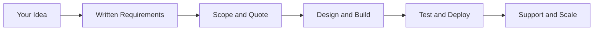

<!-- Animated brand header -->
<svg xmlns="http://www.w3.org/2000/svg" width="100%" height="240" viewBox="0 0 920 240" role="img" aria-label="Delta Innovations">
  <defs>
    <linearGradient id="orgHeroBg" x1="0%" y1="0%" x2="100%" y2="100%">
      <stop offset="0%" stop-color="#050A18"/>
      <stop offset="45%" stop-color="#0F172A"/>
      <stop offset="100%" stop-color="#1E293B"/>
    </linearGradient>
    <linearGradient id="orgHeroGlow" x1="0%" y1="100%" x2="100%" y2="0%">
      <stop offset="0%" stop-color="#22D3EE"/>
      <stop offset="50%" stop-color="#2563EB"/>
      <stop offset="100%" stop-color="#10B981"/>
    </linearGradient>
    <radialGradient id="orgOrb" cx="50%" cy="50%" r="50%">
      <stop offset="0%" stop-color="#22D3EE" stop-opacity="0.4"/>
      <stop offset="100%" stop-color="#22D3EE" stop-opacity="0"/>
    </radialGradient>
  </defs>
  <rect width="920" height="240" rx="18" fill="url(#orgHeroBg)"/>
  <circle cx="460" cy="118" r="125" fill="url(#orgOrb)">
    <animate attributeName="r" values="115;135;115" dur="6s" repeatCount="indefinite"/>
  </circle>
  <circle cx="95" cy="58" r="3" fill="#22D3EE" opacity="0.85">
    <animate attributeName="opacity" values="0.35;1;0.35" dur="3s" repeatCount="indefinite"/>
  </circle>
  <circle cx="825" cy="182" r="2.5" fill="#10B981" opacity="0.85">
    <animate attributeName="opacity" values="0.3;0.95;0.3" dur="4s" repeatCount="indefinite"/>
  </circle>
  <circle cx="760" cy="52" r="2" fill="#60A5FA" opacity="0.7">
    <animate attributeName="cy" values="48;58;48" dur="5s" repeatCount="indefinite"/>
  </circle>
  <path d="M460 58 L508 152 L412 152 Z" fill="none" stroke="url(#orgHeroGlow)" stroke-width="3.5" stroke-linejoin="round" opacity="0.95"/>
  <circle cx="460" cy="118" r="82" fill="none" stroke="#38BDF8" stroke-width="1.5" stroke-dasharray="8 10" opacity="0.5">
    <animateTransform attributeName="transform" type="rotate" from="0 460 118" to="360 460 118" dur="20s" repeatCount="indefinite"/>
  </circle>
  <text x="460" y="188" text-anchor="middle" fill="#F8FAFC" font-family="system-ui,Segoe UI,sans-serif" font-size="26" font-weight="700">Delta Innovations</text>
  <text x="460" y="214" text-anchor="middle" fill="#94A3B8" font-family="system-ui,Segoe UI,sans-serif" font-size="14">Pakistan &amp; Egypt · Digital Product Engineering</text>
</svg>

 

  

  

  

**Your trusted partner for building scalable, secure digital products**

[Website](https://delta-innovations-website.vercel.app/) · [Start a Project](https://delta-innovations-website.vercel.app/contact) · [Requirements](https://delta-innovations-website.vercel.app/requirements) · [LinkedIn](https://www.linkedin.com/company/delta-innovations) · [Repositories](https://github.com/orgs/Delta-Innovations-ORG/repositories)

---

## Who we are

**Delta Innovations** is a **Pakistan & Egypt-based digital product engineering company** helping startups and growing businesses design, build, deploy, and scale modern software — with **written requirements**, **clear milestones**, and **security built in from day one**.

We are not a random “we do everything” agency. We operate as a **structured engineering team** with transparent GitHub-based delivery and honest timelines.

| | |
|---|---|
| **Founder & CEO** | Suresh Kumar Barach |
| **Headquarters** | Pakistan · Egypt |
| **Focus** | Web · Mobile · AI · Cloud · Data · DevOps · Cybersecurity |
| **Live site** | [delta-innovations-website.vercel.app](https://delta-innovations-website.vercel.app/) |

---

## What we build

<table>
<tr>
<td width="25%" align="center">
<h3>🌐 Web</h3>
Websites, dashboards, and full-stack web applications
</td>
<td width="25%" align="center">
<h3>📱 Mobile</h3>
Android, iOS, and cross-platform products
</td>
<td width="25%" align="center">
<h3>⚙️ Backend</h3>
REST/GraphQL APIs, auth, databases, integrations
</td>
<td width="25%" align="center">
<h3>☁️ DevOps</h3>
Docker, CI/CD, cloud deployment, monitoring
</td>
</tr>
<tr>
<td width="25%" align="center">
<h3>🤖 AI / ML</h3>
Intelligent features, automation, prediction systems
</td>
<td width="25%" align="center">
<h3>📊 Data</h3>
Dashboards, KPIs, reports, business insights
</td>
<td width="25%" align="center">
<h3>🔒 Security</h3>
Secure development, hardening, security reviews
</td>
<td width="25%" align="center">
<h3>🎨 UI/UX</h3>
Product design that converts and scales
</td>
</tr>
</table>

> **Blockchain solutions** — coming soon.

---

## Tech stack

---

## How we work

| Step | Phase | Outcome |
|:----:|-------|---------|
| **01** | Requirement collection | Goals and features documented in writing |
| **02** | Scope & proposal | Milestones, timeline, and pricing agreed upfront |
| **03** | Design & development | UI/UX + engineering with regular updates |
| **04** | Testing & deployment | QA, security checks, production launch |
| **05** | Support & maintenance | Monitoring, fixes, and growth as you scale |

---

<strong>Live website preview</strong>

 

  

Official marketing site — React, TypeScript, Vite, animated brand design, lead capture, and full policy pages.

**[Open live site →](https://delta-innovations-website.vercel.app/)**

---

<strong>Why Delta Innovations?</strong>

 

| Benefit | What it means for you |
|---------|------------------------|
| **No surprise bills** | Scope and pricing agreed in writing before development |
| **Faster decisions** | Clear milestones — you always know what ships and when |
| **Lower project risk** | Documented requirements → fewer misunderstandings |
| **Production-ready delivery** | Testing, deployment, and DevOps handled professionally |
| **Transparent progress** | GitHub-based workflow — traceable, reviewable delivery |
| **Global reach, local presence** | Teams in Pakistan & Egypt with WhatsApp-friendly communication |
| **Security-first mindset** | HTTPS, env-based secrets, hardened auth — not an afterthought |

---

## Featured repository

**Official company website** — multi-page React app with SEO, JSON-LD, sitemap, CI/CD, and Vercel deployment.

---

## Mission & vision

> **Mission:** To transform business ideas into reliable digital products through clear requirements, disciplined engineering, secure development, and transparent delivery.

> **Vision:** To become a trusted technology partner for startups and growing businesses across Pakistan, Egypt, and international markets.

---

## Start your project

| Action | Link |
|--------|------|
| **Start your project** | [delta-innovations-website.vercel.app/contact](https://delta-innovations-website.vercel.app/contact) |
| **Discuss requirements** | [delta-innovations-website.vercel.app/requirements](https://delta-innovations-website.vercel.app/requirements) |
| **View services** | [delta-innovations-website.vercel.app/services](https://delta-innovations-website.vercel.app/services) |

---

## Contact

| Channel | Details |
|---------|---------|
| **Email** | [deltainnovations.co@gmail.com](mailto:deltainnovations.co@gmail.com) |
| **Projects** | [insider.daltainnovations@gmail.com](mailto:insider.daltainnovations@gmail.com) |
| **Pakistan** | +92 332 2795419 |
| **Egypt** | +20 100 2637979 |
| **WhatsApp (EG)** | +20 103 4025254 |
| **LinkedIn** | [linkedin.com/company/delta-innovations](https://www.linkedin.com/company/delta-innovations) |
| **Website** | [delta-innovations-website.vercel.app](https://delta-innovations-website.vercel.app/) |

---

 

*Engineering digital products with clarity, security, and scale.*

 

**Delta Innovations** · Pakistan & Egypt · © Delta Innovations

